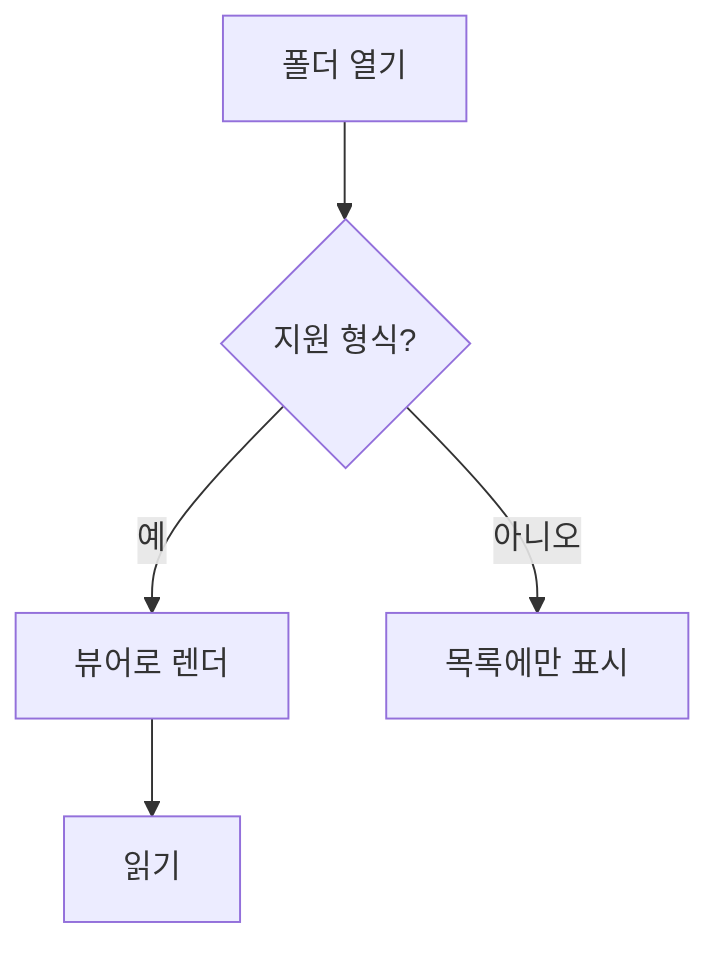

# 다이어그램과 수식

## Mermaid

폴더를 열고 문서를 읽기까지의 흐름입니다.



## 수식

인라인 수식은 문장 안에 들어갑니다. 예를 들어 $E = mc^2$ 처럼 씁니다.

블록 수식은 따로 놓입니다.

$$
\sum_{i=1}^{n} i = \frac{n(n+1)}{2}
$$

## 문법이 틀렸을 때

아래 다이어그램은 일부러 망가뜨렸습니다. 문서 전체가 죽지 않아야 합니다.

```mermaid
graph TD
  A[열린 괄호 -->
```

수식도 마찬가지입니다: $\frac{1}{$

## 수식이 아닌 달러

가격은 $5 이고 배송비는 $3 입니다. 이건 수식으로 잡히면 안 됩니다.
